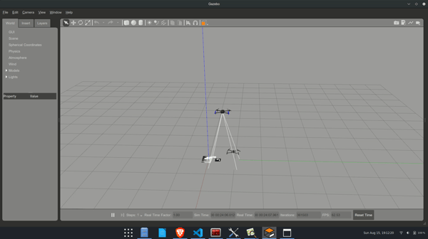
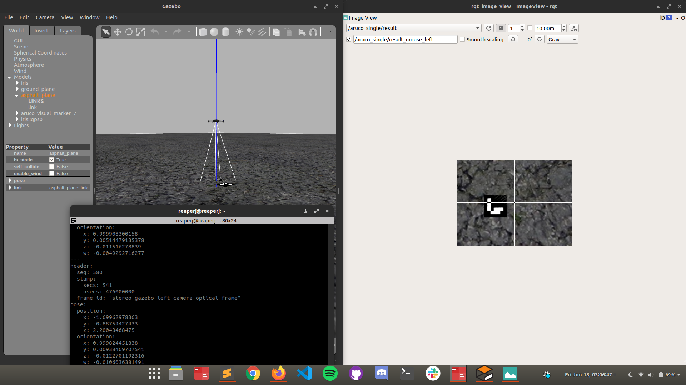
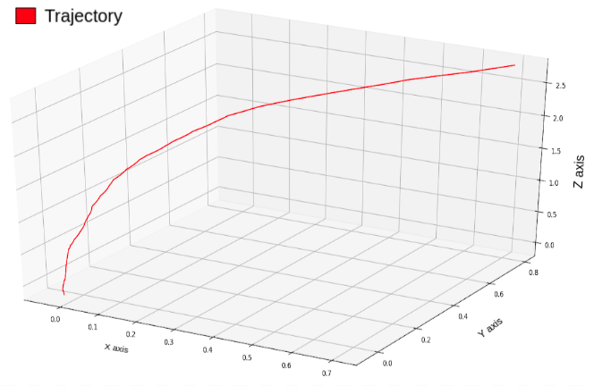

# Autonomous landing of a UAV using Pure Pursuit 

ROS packages developed for the autonomous landing of a UAV on a stationary fiducial tag using Pure Pursuit .

## Description
Aerial vehicles like quadrotors, have shown to be very  useful in many applications like mapping, object delivery, tracking etc. A key feature for these applications is that the vehicle needs to perform these tasks autonomously. Autonomous landing of an unmanned aerial vehicle or a drone is a challenging problem in aerial vehicles. This problem has been tried to solve by combining multiple sensors such as global positioning system (GPS) receivers, inertial measurement unit, and multiple camera systems. Although these approaches successfully estimate an UAVs location , many calibration processes and filtering techniques are required to achieve good landing accuracy. In other cases where UAVs operate in heterogeneous environments with no GPS signal should be considered. In mapping and object delivery applications, the vehicle landing area is constrained, and hence requires precision landing. External disturbances like winds and visibility add another challenge in actual landing scenarios. In this work, the  guidance technique of pure pursuit is adopted and modified for quadrotors. This work focuses on the development of vision-assisted guidance techniques for landing of a quadrotor. The concern of a guidance strategy is to enable persistent tracking of the landing pad or track a specific landing trajectory ending to a landing pad  which is stationary and its position is being estimated by a vision based method using a single downward facing camera to  accurately land on the target.

Some intresting Results:
Landing is a very sensitive action to perform, directly maneuvering the drone to the land site without generating a favoured trajectory leads to very rash landing.Our controller was able to generate smooth trajectories and landed the drone without generating any high jerk or snap. Below is a plot of the landing trajectory that was recorded during experimentation.

